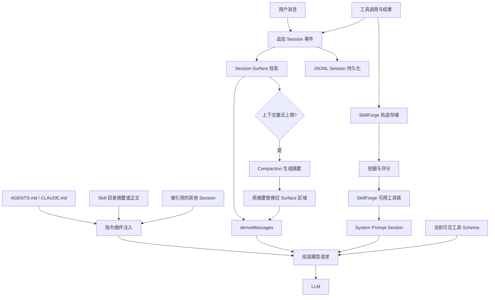

# DeepSeek Harness 记忆管理

## 摘要

DeepSeek Harness 没有一个统一的“记忆管理器”。模型每次请求时能看到的内容，由 Session 事件日志、当前 System Prompt、工具定义和本轮注入内容共同组成。Session JSONL、附件存储和 Storage Domain 分别持久化不同类型的数据，Checkpoint Policy 决定关键操作前何时必须完成落盘。长期运行时，Compaction 把较早的对话压缩成摘要；跨 Session 内容必须通过 Session Query、Session Reference、Skill、AGENTS.md 或业务插件显式取回。当前项目还启用了 SkillForge，它会把多次 Session 中成功的工具调用链提炼成可再次注入的经验。

## 目录

- [先理解模型为什么会“记得”](#先理解模型为什么会记得)
- [五类记忆](#五类记忆)
- [一次请求怎样取得记忆](#一次请求怎样取得记忆)
- [同一个 Session 的记忆](#同一个-session-的记忆)
- [持久化如何工作](#持久化如何工作)
- [上下文压缩](#上下文压缩)
- [跨 Session 读取](#跨-session-读取)
- [AGENTS.md 和 Skill](#agentsmd-和-skill)
- [当前项目的 SkillForge 学习记忆](#当前项目的-skillforge-学习记忆)
- [哪些内容可以被覆盖](#哪些内容可以被覆盖)
- [新增记忆功能应该怎样接入](#新增记忆功能应该怎样接入)
- [核心源码路径](#核心源码路径)

## 先理解模型为什么会“记得”

LLM 本身不会在两次 API 请求之间保存项目状态。每次调用模型时，Harness 都要重新发送当前有效的上下文。模型表现得像“记得”，是因为 Harness 把需要保留的内容再次放进请求。

一次模型请求可以简化为：

```text
模型请求 = System Prompt + 当前有效的 Session 消息 + 工具定义 + 本轮注入内容
```

因此，“存到了磁盘”和“模型现在能看到”是两件不同的事情：

| 内容 | 是否持久化 | 是否自动进入模型上下文 |

| 当前 Session 的用户、助手和工具消息 | 是 | 是，除非被压缩替换 |
| 其他 Session 的历史 | 是 | 否，必须查询或引用 |
| `AGENTS.md` | 文件本身是持久的 | 是，由指令插件加载 |
| Skill 正文 | 文件或 Provider 持久化 | 默认只发目录摘要，使用时才加载正文 |
| Storage Domain 中的业务数据 | 是 | 否，必须由插件读取并注入 |
| SkillForge 提炼出的工具链 | 是 | 达到门槛并处于可用状态后注入 |
| 普通项目文件 | 是 | 否，必须通过工具读取或由插件注入 |

## 五类记忆

### 1. Session 事件记忆

记录一段任务中的用户消息、助手回答、工具调用结果、请求头和生命周期事件。它是整个记忆体系的事实来源。

### 2. 压缩摘要记忆

当上下文接近模型容量时，把较早的一段历史替换成摘要，让后续请求仍能继续。原始事件没有从 Session 日志中删除。

### 3. 跨 Session 检索记忆

其他 Session 不会自动进入当前请求。模型可以通过**只读查询工具**检索旧 Session，宿主也可以通过 **Session Reference** 把指定 Session 的快照注入当前对话。

### 4. 指令记忆

`AGENTS.md`、`CLAUDE.md` 和 Skill 保存稳定、可复用的工作规则。这类内容不是模型从聊天中自行学到的，而是显式维护的指令文件。

### 5. 插件业务记忆

插件可以使用 Storage Domain 保存结构化数据，再决定何时检索、筛选和注入。当前的 SkillForge 就属于这一类。

## 一次请求怎样取得记忆



这里最重要的区别是：

- Session 日志负责保存事实。
- Surface 决定当前模型能看到哪些历史。
- Compaction 修改 Surface，但不覆盖原始事件。
- Storage 保存插件数据，但不会自动把数据发送给模型。
- System Prompt 和注入插件决定哪些外部内容进入本轮请求。

## 同一个 Session 的记忆

`Session` 使用事件溯源：所有事实先作为带类型的事件追加到日志中。`session.deriveMessages()` 再把当前 Surface 投影成模型消息。

核心过程如下：

```text
session.append(event)
        ↓
追加不可变事件
        ↓
更新 Surface 投影
        ↓
session.deriveMessages()
        ↓
得到本轮发给模型的消息历史
```

四类 Surface 事件会直接形成模型消息：

- `system/message`
- `user/message`
- `assistant/message`
- `tool/result`

其他事件可以只用于恢复、诊断、追踪和持久化，不一定出现在模型上下文中。

Session 的重要特性：

- 日志只追加，不原地修改已经提交的事件。
- Surface 可以用 `replace` 隐藏旧节点，并用新消息替换它们。
- Session 可以恢复、重放和从稳定边界 Fork。
- 模型可见的内容必须可以从 Session 日志重建。
- 内存 Session 只有在接入持久化插件后才可以跨进程恢复。

基础 Bundle 使用 JSONL 持久化插件，并把根目录配置为 `$DSH_HOME/sessions`。默认使用 Zstandard 压缩，每个 Session 保存为独立的追加日志。Session 文件不会由该插件自动删除。

核心实现：

- [`packages/core/session/src/index.ts`](../packages/core/session/src/index.ts)：Session Store、创建、Fork 和 Flush。
- [`packages/core/session/src/types.ts`](../packages/core/session/src/types.ts)：Session 事件类型。
- [`packages/core/session/src/surface.ts`](../packages/core/session/src/surface.ts)：Surface 投影和替换规则。
- [`packages/session/session-persistence-jsonl/src/index.ts`](../packages/session/session-persistence-jsonl/src/index.ts)：JSONL 持久化插件入口。
- [`packages/session/session-persistence-jsonl/src/storage.ts`](../packages/session/session-persistence-jsonl/src/storage.ts)：日志写入、刷新和单写者管理。

## 持久化如何工作

持久化不决定模型当前能看到什么，它负责让进程退出或机器重启后仍能恢复数据。DSH 把不同性质的数据存到不同介质中，没有把所有状态写进同一个数据库。

### 持久化全景

| 持久化内容 | 默认位置 | 是否是权威数据 | 用途 |
|---|---|---:|---|
| Session 事件日志 | `$DSH_HOME/sessions` | 是 | 恢复对话、工具结果、请求配置和事件历史 |
| 附件对象 | `$DSH_HOME/attachments/v1` | 是 | 保存图片和普通文件的实际字节 |
| Storage Domain | `$DSH_HOME/storages` | 是 | 保存 Workspace、设置、SkillForge 等插件数据 |
| Session Projection Cache | `$DSH_HOME/storages/session_projcache` | 否 | 加速标题、统计、Goal 等投影读取 |
| Session Query SQLite | Profile 指定的 SQLite 文件，或 `:memory:` | 否 | 为 Session 全文检索建立可重建索引 |
| 附件请求缓存 | `$DSH_HOME/cache/attachments/request-images` | 否 | 缓存适配不同模型路线的图片版本 |

权威数据丢失会失去事实；缓存或搜索索引丢失只影响速度或搜索能力，可以从权威数据重新生成。

### Session 如何写入磁盘

基础 Bundle 把 `dsh-session-persistence-jsonl` 的根目录设置为 `$DSH_HOME/sessions`。每个 Session 拥有一个目录，目录按工作区和 Session ID 隔离：

```text
$DSH_HOME/sessions/
  --<规范化的工作目录>--/
    <编码后的 Session ID>/
      session.vN.jsonl.zstd
      session.lock
```

默认文件由多个带校验和的 Zstandard Frame 组成：第一个 Frame 保存 Session Header，后续每个 Frame 保存一批事件。设置 `compression: none` 时改为普通 JSONL 文本。

写入流程可以简化为：

```text
Session.append(event)
        ↓
事件进入内存 Session 和持久化写入缓冲
        ↓
JSONL Handle 按顺序组装连续事件批次
        ↓
追加文件并执行 fsync
        ↓
写入 Promise 成功
```

Session 创建采用延迟实体化：只调用 `create()` 不会立即产生文件。第一次追加事件时，Backend 才创建 Header 和第一批事件；如果空 Session 被显式 `flush()`，则只写入 Header，使空 Session 也能在重启后被发现。

已经提交的事件不会原地重写。后续批次只追加到当前文件。写入或 `fsync` 失败时，Backend 会把文件恢复到写入前的长度，并让当前操作失败。

### Checkpoint Policy 决定什么时候必须落盘

Persistence Backend 负责“怎样写”，`dsh-session-checkpoint-policy` 负责“什么时候必须等到写完”。基础 Bundle 同时启用了两者。

它在三个时间点建立持久化屏障：

1. **模型请求之前**：先持久化该请求对应的 Session 事件，再创建模型流。
2. **顶层工具执行之前**：先持久化 `tool/call`，再让工具产生文件、网络或其他外部副作用。嵌套工具复用外层屏障。
3. **下一 Agent Step 之前**：先持久化上一 Step 的助手响应和有序工具结果，再推导下一次请求。

```mermaid
sequenceDiagram
    participant Loop as Agent Loop
    participant Session
    participant Store as JSONL Store
    participant External as LLM / Tool

    Loop->>Session: 追加 request 或 tool/call
    Loop->>Store: session.flush()
    Store-->>Loop: fsync 完成
    Loop->>External: 发起模型请求或执行顶层工具
    External-->>Loop: 返回响应或结果
    Loop->>Session: 追加 assistant/message 或 tool/result
    Loop->>Store: 下一 Step 前 flush()
```

如果关键 `flush()` 失败，系统采用 Fail-Closed 行为：模型请求或顶层工具主体不会执行。这样可以避免外部操作已经发生，但对应调用记录尚未持久化。

核心实现：

- [`packages/session/session-checkpoint-policy/src/index.ts`](../packages/session/session-checkpoint-policy/src/index.ts)：三个持久化屏障。
- [`packages/session/session-persistence-jsonl/src/storage.ts`](../packages/session/session-persistence-jsonl/src/storage.ts)：写入缓冲、单飞 Drain、`flush()` 和 Handle 生命周期。

### 崩溃以后如何恢复

恢复时，Backend 读取 Header 和所有完整事件，并重新构造 Session。针对最后一次未完成操作，恢复规则区分两种情况：

- Assistant 已经请求工具，但 `tool/call` 没有持久化：补充 `TOOL_NOT_STARTED`，说明工具没有开始。
- `tool/call` 已持久化，但没有 `tool/result`：补充 `TOOL_OUTCOME_UNKNOWN`，说明工具可能已经产生副作用，不能盲目重试。

原始 JSONL 的不完整末行会被丢弃。压缩文件中撕裂的最后一个 Frame 只保留能够完整解码的 JSONL 记录；下一次写打开时会截断损坏尾部，并先重新持久化已恢复的完整记录。完整 Frame 的校验和、解压或结构错误会被当作数据损坏并拒绝加载。

### 并发写入和版本迁移

同一个 Session 同时只允许一个写者：

- 进程内通过 Handle 所有权阻止第二个写 Handle。
- POSIX 使用 `flock` 锁定 `session.lock`。
- Windows 使用由锁路径生成的内核 Semaphore。
- 进程崩溃后，操作系统释放锁，新的进程才能继续写入。

Session 格式升级时，旧代文件不会被移动、覆盖或删除。只读打开会在内存中迁移为当前逻辑事件；写打开会生成一个版本号更高的新文件，并保留旧文件。运行时选择版本号最高的规范文件。

持久化插件本身不删除 Session 文件，因此 `$DSH_HOME/sessions` 会持续增长。清理策略目前属于外部运维操作，不能直接删除仍可能被恢复、Fork 或引用的 Session。

### Storage Domain 如何持久化插件状态

Session 之外的结构化状态使用 `storage-domain`。业务插件通过 `defineDomain()` 声明 Domain 名称、版本和 Zod Schema，再通过表的 `put`、`update` 和 `delete` 修改数据。

一次写入的顺序是：

```text
进入 Domain 写入队列
        ↓
Backend 完成持久写入
        ↓
更新内存中的权威值
        ↓
发出 domain/changed
```

Backend 写入失败时，内存值保持不变。读取直接从已经通过 Schema 校验的内存状态返回；`domain/changed` 只在当前进程内广播。

基础 Bundle 使用 JSON Backend，并把根目录设置为 `$DSH_HOME/storages`。默认 `single` 布局把一个 Domain 写成一个 JSON 文件；`per-record` 布局给每条记录单独写一个版本化 JSON 文件。每次 JSON 写入使用临时文件、`fsync` 和原子替换。高频或大规模数据可以通过 `storage-domain.routes` 路由到 SQLite Backend。

Storage Domain 当前不自动迁移不兼容版本。磁盘版本与 Domain Spec 不同时，打开操作会以 `version-mismatch` 失败，数据拥有者必须提供明确的迁移或处置流程。

核心实现：

- [`packages/storage/storage-domain/src/spec.ts`](../packages/storage/storage-domain/src/spec.ts)：Domain 和 Table 声明。
- [`packages/storage/storage-domain/src/domain.ts`](../packages/storage/storage-domain/src/domain.ts)：写入队列、内存状态和变更事件。
- [`packages/storage/storage-json/src/single-unit.ts`](../packages/storage/storage-json/src/single-unit.ts)：整份 JSON 文件持久化。
- [`packages/storage/storage-json/src/per-record-unit.ts`](../packages/storage/storage-json/src/per-record-unit.ts)：每条记录单文件持久化。
- [`packages/storage/storage-json/src/atomic.ts`](../packages/storage/storage-json/src/atomic.ts)：临时文件、同步和原子发布。

### 附件为什么不直接写进 Session 日志

图片和普通文件体积较大，因此 Session 消息只保存内容寻址引用，实际字节由 `dsh-attachment-local` 保存：

```text
$DSH_HOME/attachments/v1/objects/<哈希前缀>/<sha256>       # 规范化图片
$DSH_HOME/attachments/v1/file-objects/<前缀>/<sha256>     # 普通文件对象
$DSH_HOME/attachments/v1/files/<前缀>/<sha256>/<文件名>  # 只读文件引用
```

相同字节只保存一次。写入先进入临时目录，随后通过同步和原子 Hard Link 发布；读取时重新校验长度和哈希。附件不会自动删除，并且只在运行 DSH 的本机可用。

源码入口：[`packages/attachment/attachment-local/src/index.ts`](../packages/attachment/attachment-local/src/index.ts) 和 [`packages/attachment/attachment-local/src/store.ts`](../packages/attachment/attachment-local/src/store.ts)。

### Projection Cache 和搜索索引不是事实来源

Session Projection Cache 保存标题、统计、Goal 等计算结果，避免每次列表展示都重新读取完整 Session 日志。它允许落后于 Session 日志，但不能领先于已经持久化的事件；记录失效时可以重新折叠日志生成。基础 Bundle 将它配置为每 `200` 个事件或最长 `5000 ms` 写一次，并在 Session 创建、`turn/end` 和 Session 释放时强制写入。

Session Query SQLite 保存的是全文检索派生索引。它比较 Session 持久化文件的 Revision，只重新读取新增或变化的日志，并在事务中更新索引。索引可以删除和重建，不能把它当作 Session 备份。

当前基础配置使用：

```yaml
path: ':memory:'
openAt: never
```

因此默认没有打开 SQLite 全文索引。只有 Profile 把 `openAt` 改为 `first-search` 或 `startup` 并提供持久路径后，搜索索引才会跨进程保留。

核心实现：

- [`packages/session/session-projection-cache/src/index.ts`](../packages/session/session-projection-cache/src/index.ts)：投影检查点写入和读取。
- [`packages/session/session-projection-cache/src/spec.ts`](../packages/session/session-projection-cache/src/spec.ts)：投影缓存 Domain。
- [`packages/session-query/session-query-sqlite/src/index.ts`](../packages/session-query/session-query-sqlite/src/index.ts)：SQLite 索引打开、同步和查询。
- [`packages/session-query/session-query-sqlite/src/schema.ts`](../packages/session-query/session-query-sqlite/src/schema.ts)：派生索引 Schema 和版本。

## 上下文压缩

同一 Session 可以很长，但模型上下文有上限。`dsh-compaction-basic` 在达到阈值时压缩较早的历史。

默认策略：

- 使用达到模型上下文窗口 `80%` 作为自动压缩阈值。
- 保留最新 `16%` 的对话内容原文。
- 用一次额外的模型请求生成旧历史摘要。
- 也可以通过 `/compact` 手动触发。
- 如果启用了 Tool Result Pruner，会先缩减过大的工具结果。

压缩后的状态是：

```text
原 Surface：系统消息 + 较早历史 + 最近历史
新 Surface：系统消息 + 压缩摘要 + 最近历史
原始日志：仍保留所有原始事件和压缩事件
```

因此，压缩不是删除记忆，而是改变下一次请求所使用的历史表示。摘要以后还可能被下一轮压缩再次替换。系统提示词、工具 Schema 和不可拆分的单个巨大消息不能由普通历史压缩解决。

核心实现：

- [`packages/compaction/compaction-basic/src/index.ts`](../packages/compaction/compaction-basic/src/index.ts)：自动触发、溢出恢复和配置。
- [`packages/compaction/compaction-basic/src/region.ts`](../packages/compaction/compaction-basic/src/region.ts)：选择压缩区域并提交 Surface 替换。
- [`packages/compaction/compaction-basic/src/summarizer.ts`](../packages/compaction/compaction-basic/src/summarizer.ts)：摘要模型请求。
- [`packages/compaction/compaction-tool-result-pruner/src/index.ts`](../packages/compaction/compaction-tool-result-pruner/src/index.ts)：大工具结果裁剪。
- [`packages/compaction/command-compact/src/index.ts`](../packages/compaction/command-compact/src/index.ts)：`/compact` 命令。

## 跨 Session 读取

一个 Session 默认只有自己的事件历史。新 Session 不会自动继承旧 Session 的全部内容，否则上下文会持续膨胀，并且容易把不相关或不可信的信息混进当前任务。

项目提供两种主要方式。

### Session Query

`dsh-tool-session-query` 向模型提供五个只读工具：

| 工具 | 作用 |

| `session_search` | 搜索匹配的旧 Session |
| `session_event_search` | 在指定 Session 内搜索事件 |
| `session_trace` | 查看 Session 的父子关系 |
| `session_event_trace` | 查看事件替换和引用关系 |
| `session_event_read` | 读取完整事件和相邻摘要 |

跨 Session 访问要求目标 Session 与当前 Session 的 `cwd` 完全相同；没有 `cwd` 的调用者只能读取自己。这个工具插件是可选的，它会给每次请求增加固定提示和五个工具 Schema。

基础 Bundle 虽然注册了 Session Query 服务，但默认配置是 `openAt: never`，不会启用全文搜索。需要通过 Profile Overlay 显式改成 `first-search` 或 `startup`，通常还要配置持久化 SQLite 路径。

核心实现：

- [`packages/session-query/session-query/src/index.ts`](../packages/session-query/session-query/src/index.ts)：查询服务接口。
- [`packages/session-query/session-query-sqlite/src/index.ts`](../packages/session-query/session-query-sqlite/src/index.ts)：SQLite 查询实现。
- [`packages/session-query/tool-session-query/src/index.ts`](../packages/session-query/tool-session-query/src/index.ts)：模型工具和提示注册。
- [`packages/session-query/tool-session-query/src/operations.ts`](../packages/session-query/tool-session-query/src/operations.ts)：五个查询流程。
- [`packages/session-query/tool-session-query/src/workspace-access.ts`](../packages/session-query/tool-session-query/src/workspace-access.ts)：工作区授权。

### Session Reference

Session Reference 适合用户在当前消息中明确引用另一个 Session。宿主把 `@label` 转成规范 URI，插件读取被引用 Session 的当前快照，并把有大小限制的只读内容作为“不可信背景”追加到当前 Session。

它具有以下限制：

- 一条消息最多引用三个不同 Session。
- 引用内容是捕获时的快照，不会随源 Session 更新。
- 不会递归携带工具、推理或其他注入上下文。
- 引用内容不能自行授予权限，也不能要求当前模型执行其中的指令。

核心实现：

- [`packages/context/session-reference/src/index.ts`](../packages/context/session-reference/src/index.ts)：引用解析、候选发现和注入。
- [`packages/context/session-reference/src/projection.ts`](../packages/context/session-reference/src/projection.ts)：Session 快照投影和大小控制。
- [`packages/context/session-reference/src/serialization.ts`](../packages/context/session-reference/src/serialization.ts)：安全序列化。

## AGENTS.md 和 Skill

### AGENTS.md

`dsh-agent-instructions` 在第一次请求前加载用户级和项目级指令，并作为持久的 `user/message` 写入 Session。项目目录越深，越具体的指令优先。

默认候选文件包括：

- `$DSH_HOME/AGENTS.md`
- 项目根到当前工作目录之间的 `AGENTS.md`
- 同一路径中的 `CLAUDE.md`
- 本地覆盖文件 `AGENTS.local.md` 和 `CLAUDE.local.md`

基础 Bundle 给完整指令链设置了 `65536` 字节预算。成功使用 `read`、`write` 或 `edit` 进入更深目录后，插件会在后续请求检查新增、变化或删除的嵌套指令。它不是持续运行的文件监听器。

源码入口：[`packages/context/agent-instructions/src/index.ts`](../packages/context/agent-instructions/src/index.ts)。

### Skill

Skill 是可复用的任务说明。文件系统 Provider 默认可以从项目级、用户级和内置目录发现 Skill，包括：

- 项目的 `.dsh/skills`
- 项目的 `.agents/skills`
- `$DSH_HOME/skills`
- `$DSH_AGENTS_HOME/skills`
- Harness 内置 Skill 根目录

模型不会在每次请求中收到所有 Skill 正文。正常流程是：

1. `tool-skill` 把 Skill 名称和简短描述组成目录，记录进 Session。
2. 模型判断某项任务匹配某个 Skill。
3. 模型调用 `skill` 工具。
4. 工具返回完整 `SKILL.md` 内容。
5. Skill 正文作为工具结果保留在后续上下文中，直到被压缩。

如果用户显式使用支持用户调用的 `/skill-name`，插件可以直接把 Skill 正文作为本轮指令注入，不再要求模型调用 `skill` 工具。

核心实现：

- [`packages/skill/skill/src/index.ts`](../packages/skill/skill/src/index.ts)：Skill 服务和数据类型。
- [`packages/skill/skill-filesystem/src/index.ts`](../packages/skill/skill-filesystem/src/index.ts)：文件系统发现。
- [`packages/skill/tool-skill/src/index.ts`](../packages/skill/tool-skill/src/index.ts)：Skill 目录、`skill` 工具和显式调用注入。

## 当前项目的 SkillForge 学习记忆

当前 Web Profile 已启用 `@deepseek-ai/dsh-integration-skillforge`。它不是 Session 核心的一部分，而是建立在 Session 事件、Storage Domain、工具钩子和 System Prompt 扩展点上的学习插件。

### 数据流

```text
session/event 中的 tool/call 与 tool/result
                    ↓
turn/end 生成一条 trajectory
                    ↓
写入 skillforge Storage Domain 和 JSONL Mirror
                    ↓
失败调用 → 分类 → 规则与恢复提示
成功调用链 → 滑动窗口挖掘 → 评分
                    ↓
ACTIVE / CANARY Skill
                    ↓
满足跨 Session 证据门槛后注入 System Prompt
```

SkillForge 保存七类数据表：

- `trajectories`：每轮工具调用轨迹。
- `failures`：失败样本。
- `rules`：从失败中提炼的前置规则。
- `skills`：从成功调用链中挖掘出的 Skill。
- `verifications`：后置条件失败记录。
- `injections`：被注入过的 Skill 集合。
- `skill_revisions`：Skill 历史版本，支持恢复。

除了 Storage Domain，它还同步追加一份恢复用日志：

```text
~/.dsh/storages/skillforge-events.jsonl
```

### 当前 Profile 的关键配置

当前配置位于 `~/.dsh/profiles/web/cordis.patch.yml`，主要参数为：

| 配置 | 当前值 | 含义 |
|---|---:|---|
| `projectName` | `s3-full` | 轨迹所属场景 |
| `collectTrajectories` | `true` | 收集工具调用轨迹 |
| `ruleGuard` | `true` | 调用工具前执行学习到的参数规则 |
| `recoveryHints` | `true` | 工具失败后提供恢复提示 |
| `skillInjection` | `true` | 把可用 Skill 注入 System Prompt |
| `minSupport` | `2` | 工具链至少出现两次才成为候选 |
| `minPathLength` / `maxPathLength` | `2` / `5` | 学习连续 2 至 5 个工具调用的链 |
| `minSessionsForInjection` | `2` | 至少来自两个 Session 才允许注入 |
| `maxStoredTrajectories` | `500` | 最多保留 500 条轨迹，超出后清理最旧记录 |
| `minMiningIntervalMs` | `30000` | 两次挖掘至少间隔 30 秒 |

可注入的 Skill 还必须处于 `ACTIVE` 或 `CANARY` 状态。注入内容只描述已经去参数化的工具调用顺序，不会直接复制旧任务中的具体参数。当前还配置了四个后置条件；后置条件失败的轮次会保留用于审计和恢复提示，但不会作为成功 Skill 的挖掘证据。

工具调用前后的两个保护点：

```text
tools/pre-execute
  └─ 检查工具 Schema 必填参数和从失败中学到的必填参数

tools/post-execute
  └─ 对失败结果增加分类信息和恢复建议
```

核心实现：

- [`packages/integrations/dsh-integration-skillforge/src/index.ts`](../packages/integrations/dsh-integration-skillforge/src/index.ts)：完整管线、监听器、Guard 和 Prompt 注入。
- [`packages/integrations/dsh-integration-skillforge/src/tracker.ts`](../packages/integrations/dsh-integration-skillforge/src/tracker.ts)：从 Session 事件组装 Turn 轨迹。
- [`packages/integrations/dsh-integration-skillforge/src/spec.ts`](../packages/integrations/dsh-integration-skillforge/src/spec.ts)：七张表的数据结构。
- [`packages/integrations/dsh-integration-skillforge/src/miner.ts`](../packages/integrations/dsh-integration-skillforge/src/miner.ts)：成功工具链挖掘。
- [`packages/integrations/dsh-integration-skillforge/src/scoring.ts`](../packages/integrations/dsh-integration-skillforge/src/scoring.ts)：评分和生命周期状态。
- [`packages/integrations/dsh-integration-skillforge/src/classifier.ts`](../packages/integrations/dsh-integration-skillforge/src/classifier.ts)：失败分类和缺参检查。
- [`packages/integrations/dsh-integration-skillforge/src/recovery.ts`](../packages/integrations/dsh-integration-skillforge/src/recovery.ts)：恢复动作和提示。

## 哪些内容可以被覆盖

| 内容 | 是否会被覆盖 | 实际行为 |

| 已提交的 Session 事件 | 否 | 只追加；原事件保留 |
| 模型当前看到的 Session Surface | 是 | Compaction 或其他 Replacement 可以用新消息替换旧区间 |
| Compaction 摘要 | 是 | 后续压缩可以再次替换旧摘要 |
| `AGENTS.md` 和 Skill 文件 | 是 | 编辑文件后，后续加载使用新版本；旧 Session 中已记录的内容仍是历史事实 |
| Storage Domain 记录 | 是 | 按表的 `put`、`delete` 和插件策略更新 |
| SkillForge 轨迹 | 会清理 | 超过 `maxStoredTrajectories` 后删除最旧记录 |
| SkillForge Skill | 会重新推导 | 后续挖掘会重新评分；也支持状态覆盖和版本恢复 |

所以，“一个 Session 只有一个沙箱状态”与“一个 Session 只有一份记忆”都不准确。Session 有一份持续追加的事实日志，但模型可见状态是这份日志在当前时刻计算出的 Surface；Surface 可以变化，原始事实仍然保留。

## 新增记忆功能应该怎样接入

如果以后要增加“项目偏好记忆”“用户习惯记忆”或“错误经验库”，建议使用下面的结构：

```text
1. 定义 Storage Domain Schema
2. 从明确的 Session 事件或用户操作收集候选事实
3. 加上 workspace / project / user Scope
4. 做去重、过期、删除和数量限制
5. 在每轮请求前只检索与当前任务相关的少量记录
6. 通过 System Prompt Section、持久 user/message 或只读工具交给模型
7. 把所有实际进入模型的内容记录到 Session，保证请求可重建
```

不要直接把全部历史 Session 拼进 Prompt。更合适的设计是“持久存储 + 按需检索 + 有界注入”：存储可以很大，进入模型的内容必须少、相关、可追踪，并且有明确的工作区隔离和删除策略。

任何写入 Session 或 SkillForge 的提示词、参数、工具结果都应按持久数据处理。新增记忆模块时需要明确敏感字段过滤、保留期限、用户删除入口和跨工作区授权，不能假设模型上下文结束后数据自动消失。

## 核心源码路径

| 模块 | 核心路径 |
|---|---|
| Session 事件日志 | [`packages/core/session/src/index.ts`](../packages/core/session/src/index.ts) |
| Session 类型 | [`packages/core/session/src/types.ts`](../packages/core/session/src/types.ts) |
| Surface 投影 | [`packages/core/session/src/surface.ts`](../packages/core/session/src/surface.ts) |
| Session 磁盘持久化 | [`packages/session/session-persistence-jsonl/src/storage.ts`](../packages/session/session-persistence-jsonl/src/storage.ts) |
| Session 落盘时机 | [`packages/session/session-checkpoint-policy/src/index.ts`](../packages/session/session-checkpoint-policy/src/index.ts) |
| Session 文件格式 | [`packages/session/session-persistence-jsonl/src/format.ts`](../packages/session/session-persistence-jsonl/src/format.ts) |
| Session 格式迁移 | [`packages/session/session-persistence-jsonl/src/generation.ts`](../packages/session/session-persistence-jsonl/src/generation.ts) |
| 附件持久化 | [`packages/attachment/attachment-local/src/store.ts`](../packages/attachment/attachment-local/src/store.ts) |
| 自动压缩 | [`packages/compaction/compaction-basic/src/index.ts`](../packages/compaction/compaction-basic/src/index.ts) |
| 跨 Session 查询工具 | [`packages/session-query/tool-session-query/src/index.ts`](../packages/session-query/tool-session-query/src/index.ts) |
| Session 引用 | [`packages/context/session-reference/src/index.ts`](../packages/context/session-reference/src/index.ts) |
| 工作区指令 | [`packages/context/agent-instructions/src/index.ts`](../packages/context/agent-instructions/src/index.ts) |
| Skill 加载 | [`packages/skill/tool-skill/src/index.ts`](../packages/skill/tool-skill/src/index.ts) |
| 结构化持久存储 | [`packages/storage/storage-domain/src/index.ts`](../packages/storage/storage-domain/src/index.ts) |
| JSON Storage Backend | [`packages/storage/storage-json/src/index.ts`](../packages/storage/storage-json/src/index.ts) |
| Session Projection Cache | [`packages/session/session-projection-cache/src/index.ts`](../packages/session/session-projection-cache/src/index.ts) |
| Session 搜索索引 | [`packages/session-query/session-query-sqlite/src/index.ts`](../packages/session-query/session-query-sqlite/src/index.ts) |
| SkillForge 学习循环 | [`packages/integrations/dsh-integration-skillforge/src/index.ts`](../packages/integrations/dsh-integration-skillforge/src/index.ts) |
| 基础插件装配 | [`packages/bundle/base/cordis.patch.yml`](../packages/bundle/base/cordis.patch.yml) |
