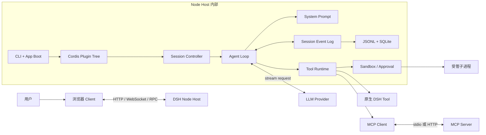
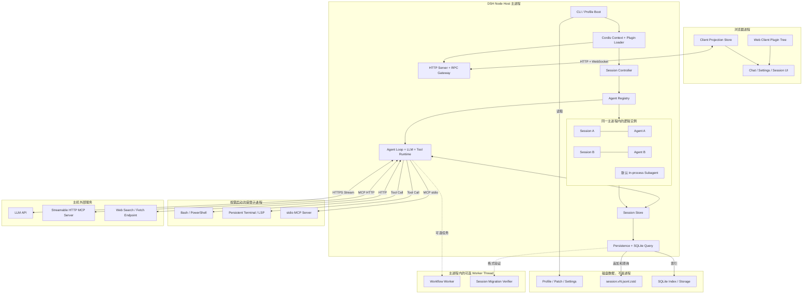
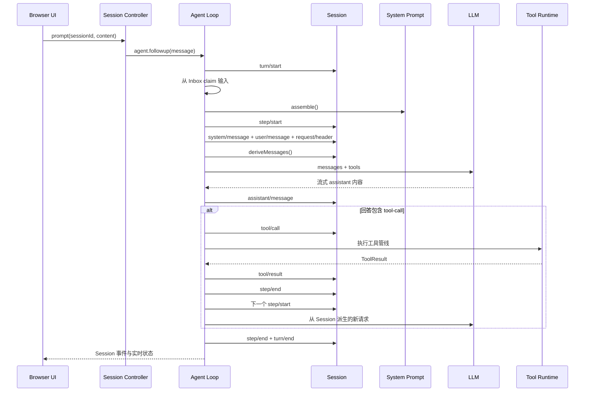

# DeepSeek Harness 整体运行架构

## 摘要

DeepSeek Harness 是一个由 Cordis Plugin 组合出来的 Agent Host。`dsh` 启动时先把 Profile、Bundle 和 Patch 合成为插件树，再挂载 Session、Agent Loop、LLM、Tool、Sandbox、Persistence 和 Web 等服务。用户的一条消息进入 Agent Inbox 后，一个 Turn 会执行一个或多个 Step；每个 Step 包含一次模型请求以及该回答要求的工具调用。所有会影响模型上下文的内容都先写入 Session 事件日志，下一次模型请求再从日志派生消息历史。

最重要的理解是：Session 不是操作系统进程，Turn 也不是一次独立进程。一个长期运行的 DSH Node Host 可以同时管理多个 Session，并按需要启动 Bash、MCP stdio Server、LSP 或其他受管子进程。

进程管理：
  浏览器进程 - HTTP/WebSocket -> DSH Node 主进程            -> 按需启动的子进程          -> 外部服务
                                Agent Loop                   Bash/PowerShell           HTTP MCP Server
                                  多个 Session                Terminal/LSP              Web Search / Fetch
                                  Tool Runtime               stdio MCP Server
                                  默认in-process Subagent
  主进程
    主进程能创建子进程
      子进程有独立的进程ID、内存空间、自己的环境变量工作目录和标准输入输出、可以启动等待或者取消它、通过管道、stdio、RPC等方式通信

## 目录

- [总体结构](#总体结构)
- [进程分配图](#进程分配图)
- [进程和逻辑对象](#进程和逻辑对象)
- [启动流程](#启动流程)
- [一条用户消息的完整流程](#一条用户消息的完整流程)
- [工具与 MCP 分支](#工具与-mcp-分支)
- [沙箱与审批](#沙箱与审批)
- [Session 与持久化](#session-与持久化)
- [Web 前后端数据流](#web-前后端数据流)
- [扩展机制](#扩展机制)
- [核心源码路径](#核心源码路径)
- [推荐阅读顺序](#推荐阅读顺序)

## 总体结构



这张图可以分成五层理解：

1. 启动与组合层决定本次运行装载哪些插件。
2. Web/API 层接收用户操作并管理 Session。
3. Agent 层执行 Turn、Step、模型请求和工具循环。
4. 能力层提供 Tool、MCP、文件、Shell、Sandbox 和 Approval。
5. 状态层把 Session 事件持久化，并向 Web 页面投影可展示状态。

## 进程分配图



这张图中的实线框表示运行单元，虚线关系表示可选任务。最容易混淆的四点是：

- `Session A`、`Session B`、Agent 和默认 In-process Subagent 都在同一个 Node Host 中，它们不是独立操作系统进程。
- 每次 Bash 调用会通过 Subprocess Provider 启动受管子进程；后台 Job 只是让该进程跨多个 Agent Step 存活。
- stdio MCP Server 是 DSH 启动的子进程；Streamable HTTP MCP Server 是主机外部服务，DSH 只建立网络连接。
- Session 文件、SQLite 索引和 Profile 配置属于磁盘状态，不执行代码，也不拥有运行线程。

## 进程和逻辑对象

### 操作系统中的运行单元

| 运行单元 | 是否独立进程 | 主要责任 |

| DSH Node Host | 是(主进程) | 装载 Cordis 插件树，管理 Agent、Session、工具、Web Server 和持久化 |
| 浏览器页面 | 是，由浏览器管理 | 显示会话、发送操作、订阅 Session 和流式输出 |
| Bash、PowerShell、LSP | 通常是子进程 | 执行命令或语言服务，由 Subprocess 和 Sandbox 能力管理 |
| stdio MCP Server | 是子进程 | 通过标准输入输出提供 MCP 工具和资源 |
| HTTP MCP Server | 通常是外部服务 | 通过 Streamable HTTP 提供 MCP 能力 |
| LLM Provider | 远程服务或适配器 | 接收消息、System Prompt 和 Tool Schema，流式返回模型内容 |
| Worker Thread | 可选线程 | 承担部分 Workflow、迁移或隔离运行任务 |

### DSH 内部的逻辑对象

| 对象 | 含义 |

| Profile | 一套可启动的插件组合，例如 `web`、`headless`、`sdk` |
| Plugin | 向 Cordis Context 注册服务、事件、工具或策略的模块 |
| Session | 一个 append-only 事件日志，表示一段可恢复的 Agent 交互历史 |
| Agent | 某个活跃 Session 的运行控制器，拥有 Inbox、状态和作用域 |
| Turn | 从接收一批用户输入到自然停止的一轮工作 |
| Step | 一次模型请求，加上该回答产生的工具调用 |
| Tool Call | 模型生成的一次结构化函数调用 |

一个 Turn 可以包含多个 Step。例如模型第一次回答要求调用 `read`，工具结果写入 Session 后，Agent Loop 会开始下一个 Step，再把结果交给模型。因此“一条用户消息”不等于“一次模型请求”。

## 启动流程

```text
终端执行 dsh web
  → apps/cli/src/bin.ts 解析参数并加载环境变量
  → profile-boot.ts 定位 $DSH_HOME/profiles/web
  → 依次合并 Bundle、Profile Patch、Home Patch、--patch
  → app-boot 创建 Cordis Context 和 Loader
  → Loader 按依赖关系挂载每一个配置行对应的 Plugin
  → Session、LLM、Tool、Sandbox、Persistence 等基础服务就绪
  → Web Bundle 挂载 HTTP Server、RPC、Client Plugin 和 UI
  → 启动检查通过后打印 URL，并按配置打开浏览器
```

环境变量按“启动进程继承的环境 → 当前调用目录 `.env` → `$DSH_HOME/.env`”的优先级解析；已经存在的高优先级值不会被低优先级文件覆盖。入口位于 [`apps/cli/src/bin.ts`](../apps/cli/src/bin.ts)，环境加载和 App Boot 位于 [`packages/boot/app-boot/src/index.ts`](../packages/boot/app-boot/src/index.ts)。

Profile 不是一份完整配置，而是多个有顺序的配置层。合成顺序如下：

```text
空配置
  → Profile 声明的 Bundle Patch
  → $DSH_HOME/profiles/<name>/cordis.patch.yml
  → $DSH_HOME/cordis.patch.yml
  → 命令行 --patch 文件
```

同一个 `id` 的后层 Patch 可以替换前层配置；`insert` 可以加入新 Plugin。Profile 解析和运行入口位于 [`apps/cli/src/profile-boot.ts`](../apps/cli/src/profile-boot.ts)，基础组合位于 [`packages/bundle/base/cordis.patch.yml`](../packages/bundle/base/cordis.patch.yml)，Web 组合位于 [`packages/bundle/web-app/cordis.patch.yml`](../packages/bundle/web-app/cordis.patch.yml)。

## 一条用户消息的完整流程



具体顺序如下：

1. Web Session Controller 找到或恢复目标 Session 的 Agent，并把用户消息交给 `agent.followup()`。
2. Agent 把消息放入 Inbox；空闲 Driver 被唤醒后记录 `turn/start`。
3. Agent Loop 组装 System Prompt 和当前 Agent 可见的 Tool Schema，再执行 `agent/pre-step` 扩展点。
4. Step 被接纳后记录 `step/start`，解析实际模型路由，并把 `system/message`、`user/message`、`request/header` 等模型可见事实写入 Session。
5. `Session.deriveMessages()` 从事件日志构造不可变的模型历史；LLM Adapter 接收消息、模型配置和工具定义。
6. 模型流式输出通过 `agent/assistant-stream` 实时发给 UI；完整结果最终记录为 `assistant/message`。
7. 如果回答包含 Tool Call，Agent Loop 记录 `tool/call`，执行 Tool Runtime 管线，再记录 `tool/result`。
8. 只要工具结果或新的 Inbox 输入要求继续，当前 Turn 就会创建下一个 Step；否则记录 `turn/end` 并把 Agent 状态改为空闲。

Agent 实现位于 [`packages/core/agent-loop/src/agent.ts`](../packages/core/agent-loop/src/agent.ts)，Agent 创建与恢复位于 [`packages/core/agent-loop/src/index.ts`](../packages/core/agent-loop/src/index.ts)，工具批次调度位于 [`packages/core/agent-loop/src/tool-calls.ts`](../packages/core/agent-loop/src/tool-calls.ts)。

## 工具与 MCP 分支

### 原生 Tool

原生 Tool Plugin 调用 `ctx.tools.register()` 注册名称、说明、参数 Schema 和执行函数。每次模型请求只发送当前 Agent 可见的名称、说明和参数 Schema；模型选择工具后，Host 才执行对应函数。注册表和统一执行管线位于 [`packages/core/tools/src/index.ts`](../packages/core/tools/src/index.ts)。

```text
ToolDefinition 注册
  → 当前 Agent 的 Scope 解析可见工具
  → Tool Schema 写入 request/header 并发送给模型
  → 模型返回 tool-call
  → 参数解析与校验
  → pre-execute / Guard / execute / post-execute
  → 结果规范化和渲染
  → tool/result 写入 Session
```

### MCP Tool

MCP Client 在 Plugin 启动时连接 Server，调用 `tools/list`，再把远端工具转换成普通 DSH Tool。因此 Agent Loop 不需要区分原生工具和 MCP 工具。

```text
mcp-client 连接 Server
  → 协商 MCP 协议
  → tools/list
  → 生成 mcp__<server>__<tool> 名称
  → ctx.tools.register()
  → 模型产生 MCP Tool Call
  → DSH Tool Runtime 执行统一策略
  → MCP Client 通过 stdio 或 HTTP 请求 Server
  → 结果转换成 DSH ToolResult
```

MCP 插件入口位于 [`packages/mcp/mcp-client/src/index.ts`](../packages/mcp/mcp-client/src/index.ts)，连接管理位于 [`packages/mcp/mcp-client/src/connection.ts`](../packages/mcp/mcp-client/src/connection.ts)，工具桥接位于 [`packages/mcp/mcp-client/src/tools.ts`](../packages/mcp/mcp-client/src/tools.ts)。

`list_mcp_resources`、`list_mcp_resource_templates` 和 `read_mcp_resource` 是共享资源工具，不是 MCP Tool 的发现接口。工具已经在 `tools/list` 阶段自动注册；模型读取 GitHub Issue 时应直接调用 `mcp__github__list_issues`。

## 沙箱与审批

Tool Runtime 提供统一的策略入口，但不同工具使用不同的限制实现：

- Bash、PowerShell 和终端把待执行 argv 交给 `ctx.sandbox.confine()`，由平台后端生成受限命令。
- 文件写入工具通过 `fs-sandbox` 在 DSH 进程内检查目标路径。
- MCP HTTP 请求在 MCP Client 内执行，不会自动经过 Bash 沙箱。
- stdio MCP Server 是 Host 启动的外部进程，也不等同于模型通过 Bash 启动的进程。

一次 Tool Call 的公共管线是：

```text
tools/pre-execute
  → 一次性审批请求
  → monotonic Tool Guards
  → tools/execute
  → Tool execute()
  → tools/post-execute
  → finalizeContent()
  → 冻结最终结果
```

Session 沙箱模式由 `sandbox-policy` 解析，当前模式、工作目录和一次性批准共同决定本次调用的权限。一次性升级只对被批准的调用生效，不会永久覆盖 Session 模式。核心实现位于 [`packages/sandbox/sandbox-policy/src/index.ts`](../packages/sandbox/sandbox-policy/src/index.ts)、[`packages/sandbox/sandbox/src/escalation.ts`](../packages/sandbox/sandbox/src/escalation.ts) 和 [`packages/core/tools/src/index.ts`](../packages/core/tools/src/index.ts)。

## Session 与持久化

Session 是整个系统的事实来源，不只是聊天文本数组。以下内容都作为事件追加：

```text
turn/start       turn/end
step/start       step/end
system/message   user/message
assistant/message
tool/call        tool/result
request/header   request/context
```

模型历史由 [`Session.deriveMessages()`](../packages/core/session/src/index.ts) 从这些事件派生。UI、恢复、Fork、统计和持久化也读取相同日志，因此不存在另一份独立的“模型聊天历史”。事件类型位于 [`packages/core/session/src/types.ts`](../packages/core/session/src/types.ts)。

默认持久化流程如下：

```text
Session.append(event)
  → 同步通知 session/event 消费者
  → JSONL Persistence 收集事件
  → Checkpoint Policy 在关键外部副作用前 flush
  → 写入 session.vN.jsonl.zstd
  → Session Query SQLite 建立查询视图
```

Checkpoint Policy 会在模型请求发出前、顶层工具主体执行前以及下一次请求边界刷新关键事件。这样，模型请求或有副作用工具开始之前，对应输入和 Tool Call 已经具有持久记录。实现位于 [`packages/session/session-checkpoint-policy/src/index.ts`](../packages/session/session-checkpoint-policy/src/index.ts)；默认 JSONL/Zstandard 后端位于 [`packages/session/session-persistence-jsonl/src/index.ts`](../packages/session/session-persistence-jsonl/src/index.ts) 和 [`packages/session/session-persistence-jsonl/src/storage.ts`](../packages/session/session-persistence-jsonl/src/storage.ts)；查询索引位于 [`packages/session-query/session-query-sqlite/src/index.ts`](../packages/session-query/session-query-sqlite/src/index.ts)。

## Web 前后端数据流

Web 模式包含两个 JavaScript 运行环境：Node Host 与浏览器 Client。它们共享类型和协议，但不共享内存对象。

```text
浏览器 Chat UI
  → Client Session 对象
  → HTTP / WebSocket RPC
  → Host API Gateway
  → Session Controller
  → Agent Registry / Agent Loop
  → session/event 与 agent/* 实时事件
  → Remote Event Stream
  → Client Projection Store
  → React UI 重新渲染
```

Host Web Server 位于 [`packages/host/webserver/src/index.ts`](../packages/host/webserver/src/index.ts)，浏览器连接位于 [`packages/client/connection/src/client/index.ts`](../packages/client/connection/src/client/index.ts)，Host Session API 位于 [`packages/api/session-controller/src/index.ts`](../packages/api/session-controller/src/index.ts)，Client Session 层位于 [`packages/api/session-controller/src/client/index.ts`](../packages/api/session-controller/src/client/index.ts)，聊天展示位于 [`packages/client/ui-chat/src/client`](../packages/client/ui-chat/src/client)。

`agent/assistant-stream` 用于显示尚未完成的实时输出；`assistant/message` 是最终可恢复记录。刷新页面后，Client 重新读取 Session 事件，而不是依赖上一次页面保留的流式片段。

## 扩展机制

项目优先通过 Plugin 和事件扩展，不直接修改 Agent Loop：

| 要增加的能力 | 推荐扩展点 |
|---|---|
| 新模型提供方 | 在 `ctx.llm` 注册 Adapter |
| 新工具 | 在 `ctx.tools` 注册 ToolDefinition |
| 外部工具服务 | 增加 `dsh-mcp-client` 配置行 |
| 新 Shell 执行环境 | 实现 `ctx.shell` 或 `ctx.subprocess` Provider |
| 新沙箱后端 | 实现 `ctx.sandbox` Provider |
| 请求前后策略 | 监听 `agent/*` 或 `tools/*` Waterfall |
| 新持久状态 | 扩展 `SessionEventMap`，并实现投影与持久化处理 |
| 新 Web 功能 | 增加 Host Remote、Client Plugin 和 UI Renderer |
| 新子 Agent 运行方式 | 实现 Subagent Provider |

所有注册都应通过 `ctx.effect()`、`ctx.on()` 或注册函数返回的 disposer 管理。Plugin 卸载时，注册行为按生命周期撤销；这也是配置热重载能够替换能力的基础。

## 核心源码路径

| 模块 | 核心责任 | 源码入口 |
|---|---|---|
| CLI | 参数解析、选择 Profile | [`apps/cli/src/bin.ts`](../apps/cli/src/bin.ts) |
| Profile Boot | 合成配置层并启动 Profile | [`apps/cli/src/profile-boot.ts`](../apps/cli/src/profile-boot.ts) |
| App Boot | 环境、Loader、启动检查 | [`packages/boot/app-boot/src/index.ts`](../packages/boot/app-boot/src/index.ts) |
| Cordis | Context、Service、Event 和 Plugin 生命周期 | [`docs/cordis-primer.md`](../docs/cordis-primer.md) |
| Agent Loop | Agent 创建、恢复与总生命周期 | [`packages/core/agent-loop/src/index.ts`](../packages/core/agent-loop/src/index.ts) |
| Agent Driver | Inbox、Turn、Step 和模型请求 | [`packages/core/agent-loop/src/agent.ts`](../packages/core/agent-loop/src/agent.ts) |
| Tool 调度 | Tool Call 分组、并行与有序提交 | [`packages/core/agent-loop/src/tool-calls.ts`](../packages/core/agent-loop/src/tool-calls.ts) |
| System Prompt | Prompt Section 组装 | [`packages/core/system-prompt/src/index.ts`](../packages/core/system-prompt/src/index.ts) |
| Session | 事件日志和消息派生 | [`packages/core/session/src/index.ts`](../packages/core/session/src/index.ts) |
| Tool Runtime | 注册、可见性、策略和执行 | [`packages/core/tools/src/index.ts`](../packages/core/tools/src/index.ts) |
| LLM | Provider/Adapter 公共接口 | [`packages/llm/llm/src/index.ts`](../packages/llm/llm/src/index.ts) |
| MCP | 外部工具连接和桥接 | [`packages/mcp/mcp-client/src/index.ts`](../packages/mcp/mcp-client/src/index.ts) |
| Sandbox | 统一沙箱类型和一次性升级 | [`packages/sandbox/sandbox/src/index.ts`](../packages/sandbox/sandbox/src/index.ts) |
| Persistence | Session JSONL/Zstandard 后端 | [`packages/session/session-persistence-jsonl/src/index.ts`](../packages/session/session-persistence-jsonl/src/index.ts) |
| Web Host | HTTP Server | [`packages/host/webserver/src/index.ts`](../packages/host/webserver/src/index.ts) |
| Web API | Session Remote API | [`packages/api/session-controller/src/index.ts`](../packages/api/session-controller/src/index.ts) |
| Web Client | Session 和 Chat UI | [`packages/api/session-controller/src/client/index.ts`](../packages/api/session-controller/src/client/index.ts) |

## 推荐阅读顺序

1. 先读 [`docs/cordis-primer.md`](../docs/cordis-primer.md)，理解 Plugin、Service、Event 和 Effect。
2. 再读 [`docs/architecture.md`](../docs/architecture.md)，建立 Profile、Session、Agent Loop 和 Capability 的总体概念。
3. 跟随 [`apps/cli/src/bin.ts`](../apps/cli/src/bin.ts) 与 [`apps/cli/src/profile-boot.ts`](../apps/cli/src/profile-boot.ts)，理解程序如何启动。
4. 阅读 [`packages/core/agent-loop/src/agent.ts`](../packages/core/agent-loop/src/agent.ts)，跟踪一条消息如何形成 Turn 和 Step。
5. 对照 [`packages/core/session/src/types.ts`](../packages/core/session/src/types.ts)，观察每一步写入什么事件。
6. 阅读 [`packages/core/tools/src/index.ts`](../packages/core/tools/src/index.ts) 和 [`packages/core/agent-loop/src/tool-calls.ts`](../packages/core/agent-loop/src/tool-calls.ts)，理解工具执行。
7. 最后按兴趣进入 MCP、Sandbox、Persistence、Subagent 或 Web 子系统。

如果只记住一条主线，可以记成：

```text
Profile 组合 Plugin
  → Plugin 提供 Service
  → Web/API 把消息送入 Agent
  → Agent Loop 用 Session 组装模型请求
  → 模型决定是否调用 Tool
  → Tool 经过策略后执行
  → 所有模型可见结果写回 Session
  → Session 同时驱动下一次模型请求、持久化和 UI
```
